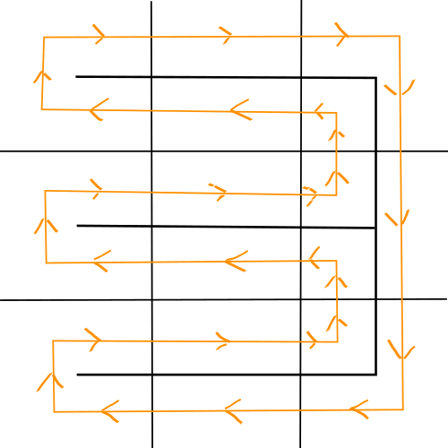
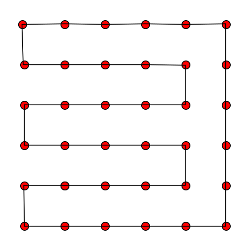

# Snake_Hamiltonian_Cycle_Solver
An automated game solver of the popular 1997 game, Snake. It finds a Hamiltonian cycle using Prim's algorithm to provide the snake with a path that prevents it from colliding with a boundary or with itself.

## Prim's algorithm
Prim's algorithm is generally used for the purpose of finding a minimum spanning tree for a weighted, undirected graph. However, by assigning the weights randomly we can also use this algorithm to generate random paths. This is used for the purpose of creating a randomized maze.
The process involves beginning with a grid of any size.
1. Choose a random cell to be the starting position.
2. Keep track of all adjacent cells.
3. Randomly choose an adjacent cell (lowest edge weight) and create a wall connecting two cells.
For a 3x3 grid this can result in a configuration such as

  

## Generating a Hamiltonian cycle
This program avoids exponential time algorithms when generating a hamiltonian cycle by doubling the width and height of the grid and creating a bubble around the randomly generated maze wall which can also be interpreted as continually following across the left side of the maze wall. Using the previously generated maze above we would get

  
  

## References
[https://johnflux.com/2015/05/02/nokia-6110-part-3-algorithms/](https://johnflux.com/2015/05/02/nokia-6110-part-3-algorithms/)
[https://hurna.io/academy/algorithms/maze_generator/prim_s.html](https://hurna.io/academy/algorithms/maze_generator/prim_s.html)
